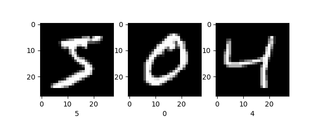
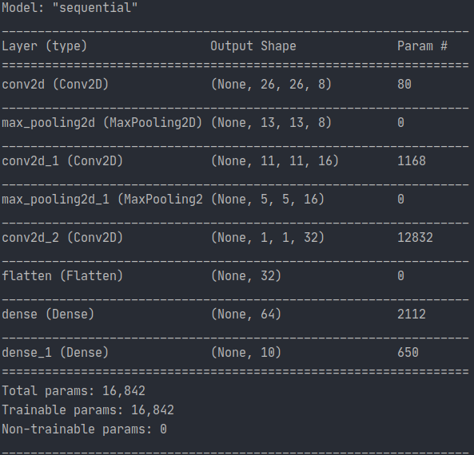

# Train handwriting model on MNIST dataset

## Introduction

This example aims to demonstrate how to train a neural network model and deploy the model to HIMAX WE1 EVB. We will take MNIST dataset as model example in the following section. Notice that we will change data type to INT8 for better performance in HIMAX WE1 EVB.

## Prerequisites
* Python >= 3.5
* numpy >= 1.18.5
* tensorflow >= 2.3
* matplotlib >= 3.3.1
* [vim] (only if your environment is windows)

[vim]: https://www.vim.org/download.php#pc  "vim.org download page"

you can also try to install by `pip` or `pip3` depend on your environment.

```
pip install -r requirements.txt
```
or
```
pip3 install -r requirements.txt
```

## Tutorial

### Overview

Training detail will be described from load dataset to create/test target model. Code data in each step can be found at `train_and_quantize.py`.

* Load Dataset
  1. Load MNIST dataset:  
  Because the tf.keras.datasets class contains many different datasets, which 
  happens to have the mnist dataset we need in this example, use `tf.keras.datasets.mnist.load_data()`
  to download and load the mnist data set.  
  `plt` python package which visualizes dataset to scrren for better understand of the dataset.
 
* Pre-processing Data
  1. Subtract 128 from the data:  
  We use data type `float32` as a container for raw data and subtract data value `128` for latter use.
  data range will be limited to -128 to 127, which will be more convenient at Quantize model step.
    
  2. Use of `np.expand_dims()`, add dimension to data:  
  MNIST data structure is (batch size, 28, 28), we use `numpy.expand_dims()` adds one dimension of 
  grayscale channel to meet convolution layer input data structure(batch size, height, width, color channel).
  
* Create Model
   1. Choosing neural network layer:  
   Most common neural network layers used for simple neural network are convolution layer, 
   maximum pooling layer and the fully connected layer.
        * `Convolutional layer` is good at processing image information, and 
        it only takes few parameters, which can effectively reduce the size of the model 
        and prevent a certain degree of overfitting.
        
        * `Maximum pooling layer` uses a filter to slide on feature map, and extract
        the maximum information. It not only have no parameter, but also can let reduce size of model weight.
        
        * `Fully connected layer` is a basic neural network layer, which mainly connects 
        all the neurons in the upper layer and uses weight of layer to implement linear transformation.
        
        * `Relu activation function` is often used by general neural networks, it has many advantages compare to 
        sigmoid (such as better avoiding to gradient vanishing and gradient exploding and increases the sparsity of 
        network parameters, faster calculation speed, etc).
        
   2. How to calculate output tensor size:  
   When creating a model, the most important thing is to calculate each layers output size, if
   you want to do some operation like element-wise multiplication or outputting specified size, the tensor size 
   would be the problem.  
   Therefore, understanding the padding, strides, and filter size of each network layer is very 
   helpful for calculating the output size.  
   For example, the output formula of convolutional layer is as follows:  
   Denote input size as : I x I, filter size as : F x F, stride as : S x S, padding as P x P
   and output size as : O x O, so the convolution layer output size formula is as follows:
   $$O = (I − F + 2P )/S+1$$
   
   3. How to design network architeture:  
   The general classifier neural network is usually designed as an inverted pyramid, likes
   gradually reducing the image resolution and increasing the channel dimension.
   However, there are no fixed rules regarding the stride or the filter size of the neural network layer or network architecture. 
   Therefore, you can refer to the most commonly used backbone network, such as VGG, Resnet, etc and gain more experience to obtain 
   better network structure in datasets 
  
* Compile and Train model
   1. How to set optimizer and loss function:
   keras model uses `.compile()` function to set train optimizer, loss function and metrics function.
   
   2. How to choose loss function:
   The choice of loss function is usually based on the dataset and task, such as the cross entropy function 
   is usually used in classification tasks, and the MSE(mean square error) function is usually used in regression tasks.  
   
   3. Why use adam as optimizer:  
   After calculating the loss between data label and model output result with loss function, we use gradient descent 
   method and backward propagation to update neural network weight parameters.
   Because the learning rate is a hyperparameter in the weight update formula controls the amount of gradient update, 
   a optimizer will be needed for adjust this rate. A good optimizer makes good convergence speed and model accuracy.  
   There are many optimizer, Adam and SGD are most widely used optimizer in general neural network training phase.
   Adam optimizer is the optimizer that can help neural network training faster and we choose it as the optimizer in this example.
   
* Quantize Model
   1. Why need to quantize model:
   When deploying the neural network model to edge devices, we must consider storage, memory, power, latency, etc.
   Therefore, using model quantization to convert the data type from `float32` to `int8` will have the advantages such as 
   reducing model size, reducing memory consumption, increasing inference speed, and reducing device power consumption. 
   But at the same time, a certain amount of model accuracy will be lost.  
   **Thus, WE-I Plus microcontroller only accepts the tflite model of full integer quantization.**
   
   2. Quantization process details:
   Some extra data in the dataset needed to be prepared for quantization before it starts. 
   We input these data into the model to calculate the scale and zero point value in each neural network layer for 
   compression from `float32` to `int8`. 
   
* Test with quantize model
   1. Use `tf.lite.Interpreter()` to load tflite model:
   The operators of tensorflow lite model is different form general model operators, we use 
   tf.lite.Interpreter() to do it.
   
   2. Use `tf.data.Dataset.from_tensor_slices()` to create dataloader:
   Without keras API, we create dataloader by using `tf.data.Dataset.from_tensor_slices()` which is used to 
   extract batches of data in dataset.
   Then, we can use `.batch()` to set its batch size.
   
   3. Recover the model output:  
   After model quantized, output of the model has to recover the data with zero point and scale likes the equation below:  
   $$output_{real} = (output_{int8} -zero\_points) * scale$$
    
   4. About the model accuracy after quantization:  
   Compare the difference between accuracy of the model before and after quantization, it can be found that 
   the accuracy has decreased but the difference is small.
 


### 1. Load Dataset

Import require python package:

```(python)
import os
import numpy as np                  #python Scientific Computing toolkit
import tensorflow as tf             #deeplearning framework
import matplotlib.pyplot as plt     #Data visualization toolkit
from argparse import ArgumentParser
```

Use tf.keras.datasets to load mnist dataset:

```(python)
(train_data, train_label), (test_data, test_label) = tf.keras.datasets.mnist.load_data()
```

Use plt package to print the first three training data image:

```(python)
for i in range(3):
    plt.subplot(1, 3, i+1)
    plt.imshow(train_data[i], cmap="gray")
    plt.xlabel(train_label[i])
plt.show()
```

It will show the image like below:



### 2. Pre-processing data

Use `numpy.expand_dims` to add one dimension of grayscale channel and transfer data type from
int8 to float32.

Subtract 128.0 from the input data to make the value range between -128 and 127.

```(python)
train_data = np.expand_dims(train_data.astype(np.float32) - 128.0, axis=-1)
test_data = np.expand_dims(test_data.astype(np.float32) - 128.0, axis=-1)
```

### 3. Create model

Use [tf.keras.Sequential] and [.add()] to create simple convolution neural
network model.
In this example, three most common neural layers used are the 
[convolutional layer], [maximum pooling layer] and [fully connected] layer.

[tf.keras.Sequential]:https://www.tensorflow.org/api_docs/python/tf/keras/Sequential
[.add()]:https://www.tensorflow.org/api_docs/python/tf/keras/Sequential#add
[convolutional layer]:https://www.tensorflow.org/api_docs/python/tf/keras/layers/Conv2D
[maximum pooling layer]:https://www.tensorflow.org/api_docs/python/tf/keras/layers/MaxPool2D
[fully connected]:https://www.tensorflow.org/api_docs/python/tf/keras/layers/Dense

```(python)
model = tf.keras.Sequential()
model.add(tf.keras.layers.Conv2D(input_shape=(28, 28, 1), filters=8, kernel_size=[3, 3], padding='valid', activation=tf.nn.relu))
model.add(tf.keras.layers.MaxPool2D(pool_size=[2, 2], strides=2))
model.add(tf.keras.layers.Conv2D(filters=16, kernel_size=[3, 3], padding='valid', activation=tf.nn.relu))
model.add(tf.keras.layers.MaxPool2D(pool_size=[2, 2], strides=2))
model.add(tf.keras.layers.Conv2D(filters=32, kernel_size=[5, 5], padding='valid', activation=None))
model.add(tf.keras.layers.Flatten())
model.add(tf.keras.layers.Dense(64, activation='relu'))
model.add(tf.keras.layers.Dense(10))
```

Use [summary()] to show the model architecture.

[summary()]:https://www.tensorflow.org/api_docs/python/tf/keras/Model#summary

```(python)
model.summary()
```



### 4. Compile and train model

Use [.compile()] to set optimizer, loss function and metrics.

[.compile()]: https://www.tensorflow.org/api_docs/python/tf/keras/Model#compile

```(python)
model.compile(optimizer='adam',
              loss=tf.keras.losses.SparseCategoricalCrossentropy(from_logits=True),
              metrics=['accuracy'])
```

Use [.fit()] to set training data and validation data and start training the model.

[.fit()]: https://www.tensorflow.org/api_docs/python/tf/keras/Model#fit

```(python)
model.fit(train_data, train_label, epochs=epochs, batch_size=batch_size, validation_data=(test_data, test_label))
```

It shows the training and testing log like below:
>


Use [.evaluate()] to calculate model accuracy and loss with test dataset, then we save results in parameter named results.

```(python)
results = model.evaluate(test_data, test_label, batch_size=128)
```

[.evaluate()]:https://www.tensorflow.org/api_docs/python/tf/keras/Model#evaluate

Use `tf.saved_model.save` to set model weight storage location and save model weight.

```(python)
tf.saved_model.save(model, os.path.join("check_point", save_model_name))
```

### 5. Quantize model

First, we define a representative data generator function, makes the network compute
each layer of zero point and scale.

```(python)
def representative_data_gen():
    for input_value in tf.data.Dataset.from_tensor_slices(test_data).batch(1).take(10000):
        # Model has only one input so each data point has one element.
        yield [input_value]
```

Second, load network weight and set `optimization Strategy` and `representative dataloader` of converter.

```(python)
converter = tf.lite.TFLiteConverter.from_saved_model(os.path.join("check_point", save_model_name))
converter.optimizations = [tf.lite.Optimize.DEFAULT]
converter.representative_dataset = representative_data_gen
```

select converter `supported_ops()` to use TensorFlow Lite built-in operators conversion models.
Then, set the input and output tensors to int8 (APIs added in r2.3)

```(python)
converter.target_spec.supported_ops = [tf.lite.OpsSet.TFLITE_BUILTINS_INT8]
converter.inference_input_type = tf.int8
converter.inference_output_type = tf.int8
```

Finally, use [convert()] to start quantize the model, then save tflite file. by using the python file stream.

```
tflite_model_quant = converter.convert()

with open(os.path.join(os.getcwd(), save_model_name+".tflite"), mode='wb') as f:
    f.write(tflite_model_quant)
```

[convert()]:https://www.tensorflow.org/api_docs/python/tf/lite/TFLiteConverter#convert

Click [here](https://www.tensorflow.org/api_docs/python/tf/lite/TFLiteConverter) to see more information
about tf.lite.TFLiteConverter class

### 6. Test with quantize model

Use [tf.lite.Interpreter()] to load saved tflite file.

[tf.lite.Interpreter()]:https://www.tensorflow.org/api_docs/python/tf/lite/Interpreter

```(python)
interpreter = tf.lite.Interpreter(model_path=save_model_name+".tflite")
```

Use [.get_input_details()] and [.get_output_details()] to load input and output information.

[.get_input_details()]:https://www.tensorflow.org/api_docs/python/tf/lite/Interpreter#get_input_details
[.get_output_details()]:https://www.tensorflow.org/api_docs/python/tf/lite/Interpreter#get_output_details

```(python)
input_details = interpreter.get_input_details()
output_details = interpreter.get_output_details()
```

Extract scale and zero point information from output_details

```(python)
scales = output_details[0]["quantization_parameters"]["scales"][0]
zero_points = output_details[0]["quantization_parameters"]["zero_points"][0]
interpreter.allocate_tensors()
```

Use [tf.data.Dastaset.from_tensor_slices] to create dataloader and use [.batch()] function to set batch size. 

Click [here](https://www.tensorflow.org/api_docs/python/tf/data/Dataset) to see more information about tf.data class

[tf.data.Dastaset.from_tensor_slices]:https://www.tensorflow.org/api_docs/python/tf/data/Dataset#from_tensor_slices
[.shuffle()]:https://www.tensorflow.org/api_docs/python/tf/data/Dataset#shuffle
[.batch()]:https://www.tensorflow.org/api_docs/python/tf/data/Dataset#batch 

```(python)
test_dataloader = tf.data.Dataset.from_tensor_slices((test_data, test_label))
test_dataloader = test_dataloader.batch(batch_size=1)
print("quantized test accuracy: {}".format(quantized_test_acc.result()))
```

Create a [SparseCategoricalAccuracy] metrics function.

[SparseCategoricalAccuracy]:https://www.tensorflow.org/api_docs/python/tf/keras/metrics/SparseCategoricalAccuracy

```(python)
quantized_test_acc = tf.keras.metrics.SparseCategoricalAccuracy()
```

Use [interpreter.set_tensor()] to set input data, and use [tf.cast()] to transform input data from float32 to int8.
Then, use [interpreter.get_tensor()] to get output result.

[interpreter.set_tensor()]:https://www.tensorflow.org/api_docs/python/tf/lite/Interpreter#set_tensor
[interpreter.get_tensor()]:https://www.tensorflow.org/api_docs/python/tf/lite/Interpreter#get_tensor
[tf.cast()]:https://www.tensorflow.org/api_docs/python/tf/cast

```(python)
for test_data, test_label in test_dataloader:
    interpreter.set_tensor(input_details[0]["index"], tf.cast(test_data, dtype=tf.int8))
    interpreter.invoke()
    output = interpreter.get_tensor(output_details[0]["index"])
```

To Recover from quantized data, we use scale and zero_points.

```(python)
    output = (output + (-zero_points)) * scales
```

Use [.update_state()] to update metrics state, then print final model accuracy.

```(python)
    predictions = tf.reshape(output, shape=(output.shape[0], 10))
    quantized_test_acc.update_state(y_true=test_label, y_pred=predictions)

print("Before quantiz accuracy: {}%".format(results[1]*100))
print("Quantized test accuracy: {}%".format(quantized_test_acc.result()*100))
print("loss acc : {}%".format((results[1] - quantized_test_acc.result())*100))
```

[.update_state()]: https://www.tensorflow.org/api_docs/python/tf/keras/metrics/SparseCategoricalAccuracy#update_state


## Usage
### Train and quantize

```(commandline)
python3 train_and_quantize.py --epochs=5 --batch-size=64 --save-model-name=mnist_cnn
```

### Convert tflite file to C file

```    
xxd -i mnist_cnn_int8.tflite model_data.cc
```

If your environment is windows, please install vim and look for the xxd.exe file path.

Try the command like below:

```     
C:\"Program Files (x86)"\Vim\vim82\xxd.exe -i mnist_cnn_int8.tflite > model.cc
```         